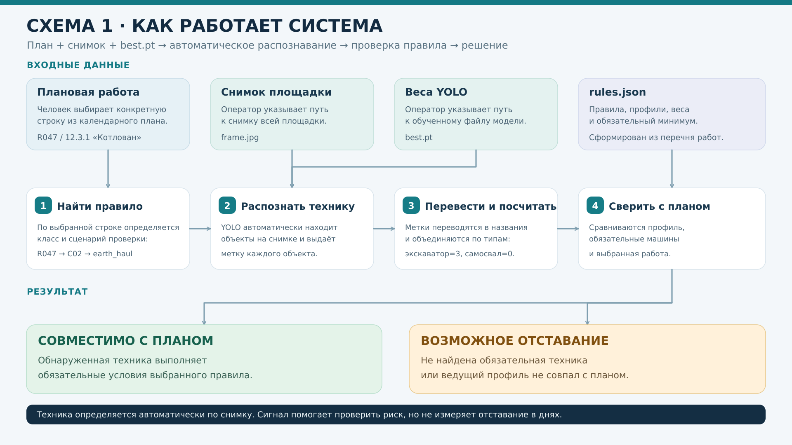
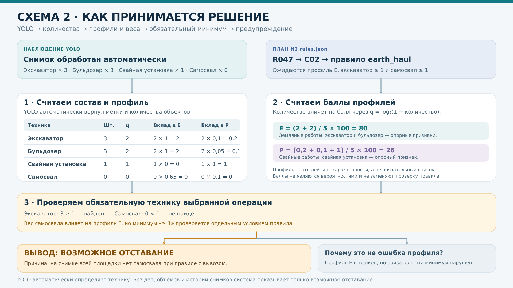

# Мониторинг строительной площадки по снимку и плану работ

Прототип сопоставляет технику, найденную на снимке всей площадки, с выбранной строкой плана строительно-монтажных работ. В настольном приложении оператор выбирает работу, снимок и обученные веса YOLO `best.pt`; результат появляется в окне, а полный отчёт можно открыть или сохранить как HTML. **Веса модели входят в репозиторий:** `best.pt`.

Результат «возможное отставание» означает повод проверить работы и календарь. По одному снимку программа не рассчитывает дни задержки и не подтверждает нарушение срока.

## Две схемы

**Общий поток:** снимок → YOLO → перевод меток и подсчёт машин → сопоставление с планом → предупреждение.



**Как принимается решение:** профили техники, веса, количество, правило выбранной работы.



## Запуск приложения

Нужен Python 3.10. В той же среде Python, где будет работать программа, установите библиотеку Ultralytics.

Запустите из каталога проекта:

```bash
python construction_app.py
```

В приложении найдите плановую работу по коду или названию и **выберите строку из списка**. Укажите снимок и путь к обученным весам YOLO `best.pt` (например, `runs/segment/train-6/weights/best.pt`). Другого источника распознавания в приложении нет; порог уверенности по умолчанию `0.3`. Кнопка **«Анализировать снимок»** покажет решение, причину, действие, найденную технику, снимок, баллы профилей и предупреждения. **«Открыть полный отчёт»** показывает его в браузере. **«Сохранить HTML»** создаёт самостоятельный файл со встроенным снимком; **«Сохранить JSON»** сохраняет данные для дальнейшей обработки.

## Метки модели YOLO

Модуль `yolo_detector.py` загружает `best.pt`, вызывает `YOLO(model_path).predict(image_path, conf=0.3, verbose=False)` и считает **каждый объект** по `result.boxes.cls`. Метки переводятся перед проверкой правил:

| Метка в датасете | Ключ проекта | Название в отчёте |
|---|---|---|
| `Excavator` | `excavator` | Экскаватор |
| `Cran little` | `mobile_crane` | Автокран |
| `Cran` | `tower_crane` | Кран |
| `Samosval` | `dump_truck` | Самосвал |
| `Concrete mixer` | `mixer` | Автобетоносмеситель |
| `Katok` | `roller` | Каток |
| `Svayi` | `pile_rig` | Свайная установка |
| `Buldozer` | `bulldozer` | Бульдозер |

Например, два объекта `Excavator` и один `Samosval` дают `{"excavator": 2, "dump_truck": 1}`. Регистр букв и лишние пробелы в метке игнорируются; неизвестная метка вызывает ошибку с её названием. Если вы переименуете классы датасета, обновите `LABEL_TO_MACHINE` в `yolo_detector.py`. Модель загружается один раз для повторных снимков в запущенном приложении.

## Как формируется решение

1. Строка `works` в `rules.json` связывает плановую работу с укрупнённым классом и правилом. Например, `R047` связан с `C02` и `earth_haul`.
2. По количеству распознанных машин оцениваются **профили техники**. Профиль — узнаваемый состав машин, который может встречаться сразу на нескольких этапах. Это не название конкретной строки исходной таблицы. Так, `L` означает признаки подъёма и монтажа по крану или автокрану; одноимённой строки в Excel может не быть.
3. Для каждой машины с количеством `n` вычисляется `q = log₂(1 + n)`. Балл профиля равен `100 × сумма(q × вес профиля) / сумма(q)` по всем найденным типам. Профиль получает балл только при наличии своей опорной техники. Веса и пороги заданы экспертно в `rules.json`; баллы **не являются вероятностями**. Множество машин влияет на преобладание профиля, но один десяток одинаковых машин не подавляет остальные в десять раз.
4. Рейтинг профилей рассчитывается **независимо от выбранной плановой работы**. Затем правило этой работы проверяет допустимые профили и минимальное количество обязательной техники. Для `earth_haul` требуется хотя бы один экскаватор и один самосвал, если действует сценарий вывоза.
5. При отсутствии необходимой техники на полном снимке программа выдаёт **возможное отставание** с причиной и действием. При совпадении признаков с планом выводится «совместимо с планом», что также не доказывает соблюдение сроков.

| Профиль | Признак |
|---|---|
| `E` | Земляные работы: экскаватор, бульдозер |
| `R` | Уплотнение и дорожные основания: каток |
| `P` | Свайные и буровые работы: свайная установка |
| `B` | Бетонирование: автобетоносмеситель |
| `L` | Подъём и монтаж: кран или автокран |

Например, при трёх экскаваторах, трёх бульдозерах и одной свайной установке значения `q` равны `2`, `2` и `1`. Получается `E = 80` баллов и `P = 26` баллов: земляные работы выражены сильнее, а свайная установка может ждать следующего этапа. Баллы профилей могут пересекаться и не должны суммироваться до 100.

Один профиль применим к нескольким классам работ. Например, экскаватор встречается при котловане и открытой прокладке сетей; список машин сам по себе не различает эти работы. Общая строка вроде `R064 / 12.3.7 «Земляные работы»` вызывает просьбу выбрать конкретную подоперацию: нельзя требовать технику всех дочерних работ одновременно.

Исходный Excel нужен только для пересборки и не обязан находиться рядом с программой при обычном запуске. В методике объединены плохо различимые по доступным видам тяжёлой техники операции, например черновая и чистовая отделка.

## Состав проекта

| Файл | Назначение |
|---|---|
| `construction_app.py`, `start_app.pyw` | Настольное приложение и запуск |
| `yolo_detector.py` | Загрузка весов YOLO, перевод восьми меток и подсчёт объектов |
| `construction_monitor.py` | Общий алгоритм, запуск YOLO, HTML-отчёт и CLI |
| `rules.json` | Каталог строк, классов, профилей, правил и порогов |
| `construction_rules.xlsx`, `work_mapping.csv` | Таблицы для просмотра привязок |
| `rebuild_rules_from_excel.py` | Пересборка правил из исходного Excel и экспертной методики |
| `scheme_1_algorithm.*`, `scheme_2_decision.*` | Схемы для демонстрации |
